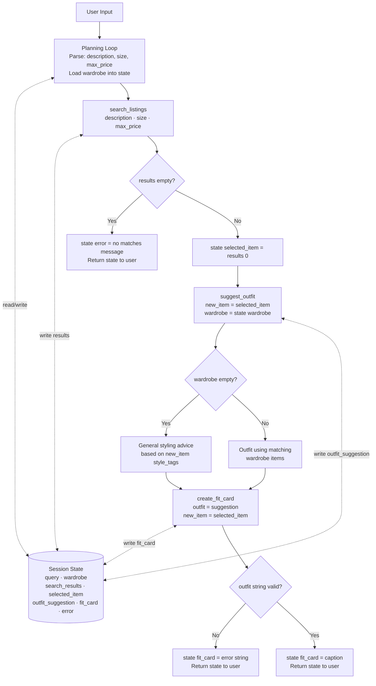

# FitFindr — planning.md

> Complete this document before writing any implementation code.
> Your spec and agent diagram are what you'll use to direct AI tools (Claude, Copilot, etc.) to generate your implementation — the more specific they are, the more useful the generated code will be.
> Your planning.md will be reviewed as part of your submission.
> Update it before starting any stretch features.

---

## Tools

List every tool your agent will use. For each tool, fill in all four fields.
You must have at least 3 tools. The three required tools are listed — add any additional tools below them.

### Tool 1: search_listings

**What it does:**
Loads all listings using `load_listings()` from `utils/data_loader.py`, then filters them against the user's description, size, and budget. Keyword matching checks the `title`, `description`, and `style_tags` fields. Size and price filters are optional — if either is `None`, that filter is skipped entirely.

**Input parameters:**
- `description` (str): natural language description of what the user wants (e.g., `"vintage graphic tee"`). The tool splits this into lowercase keywords and checks each one against listing fields — it does not require an exact phrase match.
- `size` (str | None): size string to match against the listing's `size` field. `None` means skip size filtering. Matching should be case-insensitive and tolerant of reasonable size format variations present in the dataset — exact string comparison will miss valid results.
- `max_price` (float | None): upper price limit in USD. Listings where `price > max_price` are excluded. `None` means no price filter.

**What it returns:**
A list of listing dicts. Each dict contains: `id`, `title`, `description`, `category`, `style_tags`, `size`, `condition`, `price`, `colors`, `brand`, `platform`. Returns an empty list `[]` if nothing matches — never raises an exception for an empty result.

**What happens if it fails or returns nothing:**
Returns `[]`. The planning loop checks this immediately after the call. If the list is empty, the loop sets an error in state and stops — `suggest_outfit` and `create_fit_card` are not called. The user sees a message suggesting they try a different description, remove the size filter, or raise their budget.

---

### Tool 2: suggest_outfit

**What it does:**
Given a newly found listing item and the user's wardrobe, suggests a complete outfit by identifying wardrobe items whose `style_tags` or `colors` complement the new item. If the wardrobe is empty, it returns general styling advice based on the new item's `category` and `style_tags` instead — it does not crash or stop the workflow.

**Input parameters:**
- `new_item` (dict): a single listing dict as returned by `search_listings`. Must have `style_tags`, `category`, and `colors` to work with. All field access should use `.get()` to avoid `KeyError` on malformed input.
- `wardrobe` (dict): a wardrobe dict with an `items` key containing a list of wardrobe item dicts. Loaded via `get_example_wardrobe()` for the demo or `get_empty_wardrobe()` for a new user. The tool must check `wardrobe.get("items", [])` — never assume the key exists.

**What it returns:**
A non-empty string describing the outfit suggestion. If the wardrobe has items, the string names specific pieces by their `name` field (e.g., `"Pair with your baggy dark wash jeans and chunky white sneakers."`). If the wardrobe is empty, it returns general advice based on the item's category and style tags (e.g., `"Try pairing this with straight-leg denim and chunky footwear for a streetwear look."`). Either way, the return value is a usable string — never `None` or `""`.

**What happens if it fails or returns nothing:**
An empty wardrobe is the expected failure mode and is handled by the fallback advice path above — the workflow continues to `create_fit_card`. If `new_item` is missing expected fields, the tool uses `.get()` with safe defaults rather than raising a `KeyError`.

---

### Tool 3: create_fit_card

**What it does:**
Takes the outfit suggestion string and the new item's listing dict, and generates a short, shareable social-media-style outfit caption — the kind of thing a user could post on Instagram or TikTok alongside a photo of the look. The output is natural-language prose, not a structured report. The tool guards against empty or missing outfit input before generating anything.

**Input parameters:**
- `outfit` (str): the outfit suggestion string returned by `suggest_outfit`. The tool checks that this is non-empty before proceeding. If it is `None` or `""`, the tool returns an error string instead of generating a caption.
- `new_item` (dict): the listing dict for the newly found item. Used to pull `title`, `price`, and `platform` into the caption. All field access uses `.get()` with safe defaults.

**What it returns:**
A short caption string, one to three sentences. For example:
`"Vintage grunge fit: faded graphic tee + baggy dark wash jeans + chunky sneakers. Layer the black denim jacket and you're set. Grab this tee for $24 on depop before it's gone."`

The exact wording depends on the outfit suggestion and item details. The output should read like a social-media caption, not a form or a label.

**What happens if it fails or returns nothing:**
If `outfit` is `None` or an empty string, the tool returns `"Could not generate caption — outfit suggestion was missing."` — it does not raise an exception. If `new_item` is missing `title` or `price`, the tool uses `.get()` with fallback defaults (`"Unknown item"`, `0.00`) so the caption still renders.

---

### Additional Tools (if any)

None planned for Milestone 1–4.

---

## Planning Loop

**How does your agent decide which tool to call next?**

The loop runs sequentially. Each step checks its result before continuing. If a stop condition is hit, the agent sets `state["error"]` and returns immediately without calling the remaining tools.

```
1.  Parse user message → extract description (str), size (str | None), max_price (float | None)
2.  Initialize state["wardrobe"] via get_example_wardrobe() or get_empty_wardrobe()
3.  Call search_listings(description, size, max_price)
4.  If results is [] →
        state["error"] = "No listings matched. Try a different description,
                          remove the size filter, or raise your budget."
        return state  ← stop here, do not call suggest_outfit or create_fit_card
5.  If results exist →
        state["search_results"] = results
        state["selected_item"] = results[0]
6.  Call suggest_outfit(state["selected_item"], state["wardrobe"])
7.  state["outfit_suggestion"] = returned string
8.  Call create_fit_card(state["outfit_suggestion"], state["selected_item"])
9.  state["fit_card"] = returned caption string
10. Return state
```

The agent knows it is done when step 9 completes. There is no retry logic — bad results are surfaced to the user rather than silently retried.

---

## State Management

**How does information from one tool get passed to the next?**

The agent maintains a single session state dict initialized at the start of each interaction:

```python
state = {
    "query": "",              # original user message
    "description": "",        # parsed from query
    "size": None,             # parsed from query, or None
    "max_price": None,        # parsed from query, or None
    "wardrobe": {},           # loaded at session start
    "search_results": [],     # list of dicts returned by search_listings
    "selected_item": None,    # single dict chosen from search_results
    "outfit_suggestion": None,  # string returned by suggest_outfit
    "fit_card": None,         # caption string returned by create_fit_card
    "error": None,            # set if any step hits a stop condition
}
```

Each tool reads its inputs from state and writes its output back to state before the loop advances. Because all data flows through state, each tool can also be called independently in tests by pre-populating the relevant keys — no running agent required.

---

## Error Handling

For each tool, describe the specific failure mode you're handling and what the agent does in response.

| Tool | Failure mode | Agent response |
|------|-------------|----------------|
| search_listings | Returns `[]` — no listings match the description, size, or price | Agent sets `state["error"] = "No listings matched your search. Try a different description, remove the size filter, or raise your budget."` and returns state immediately. `suggest_outfit` and `create_fit_card` are never called. |
| search_listings | `description` is an empty string | Tool runs but matches nothing and returns `[]`. Agent handles it identically to the row above — sets error and returns early. |
| suggest_outfit | `wardrobe["items"]` is an empty list | Tool returns general styling advice based on `new_item["style_tags"]` and `new_item["category"]` (e.g., `"Try pairing this with straight-leg denim and chunky footwear for a streetwear look."`). Agent saves this to `state["outfit_suggestion"]` and continues to `create_fit_card` — this is not a stop condition. |
| suggest_outfit | `new_item` is missing expected fields | Tool uses `.get()` for all field access and returns a fallback string rather than raising `KeyError`. Agent saves the fallback string and continues. |
| create_fit_card | `outfit` is `None` or empty string | Tool returns `"Could not generate caption — outfit suggestion was missing."` Agent saves this to `state["fit_card"]` and returns it to the user as the final output. |
| create_fit_card | `new_item` missing `title` or `price` | Tool uses `.get()` with safe defaults (`"Unknown item"`, `0.00`) and still generates a caption rather than crashing. |

---

## Architecture



---

## AI Tool Plan

### Milestone 3 — Individual tool implementations:

After implementing each tool, I will run the required pytest tests and a small validation script with several representative queries. This will help confirm that changes to matching logic, fallback behavior, or caption generation do not accidentally break cases that already worked.

**search_listings:**
Input to Claude: the Tool 1 spec from this document (what it does, input parameters, return value, failure mode), plus the `load_listings()` function signature and listing field list from `utils/data_loader.py`.
What I expect Claude to generate: a `search_listings(description, size, max_price)` function that calls `load_listings()`, splits `description` into lowercase keywords, filters listings by keyword match across `title`, `description`, and `style_tags`, then optionally filters by size (case-insensitive, tolerant of format variation) and by `price <= max_price`. Returns a list or `[]`.
How I'll verify it before trusting it: write three pytest tests — (1) a keyword query that should return results from the real dataset returns a non-empty list, (2) a nonsense query (e.g., `"unicorn spacesuit"`) returns `[]`, (3) a query with a `max_price` filter returns no listing with `price > max_price`.

**suggest_outfit:**
Input to Claude: the Tool 2 spec from this document, the wardrobe item field definitions from `wardrobe_schema.json`, and the note that `get_example_wardrobe()` and `get_empty_wardrobe()` are the two required test inputs.
What I expect Claude to generate: a `suggest_outfit(new_item, wardrobe)` function that finds wardrobe items with overlapping `style_tags` or `colors`, returns a descriptive string naming those pieces, and returns a general fallback string when `wardrobe.get("items", [])` is empty.
How I'll verify it: test with `get_example_wardrobe()` — confirm the output string mentions at least one wardrobe item by name. Test with `get_empty_wardrobe()` — confirm the function returns a non-empty string and does not raise any exception.

**create_fit_card:**
Input to Claude: the Tool 3 spec from this document, including the caption style description and the example one-to-three-sentence output format.
What I expect Claude to generate: a `create_fit_card(outfit, new_item)` function that checks `outfit` is non-empty before generating the caption, builds a short natural-language social-media caption using `new_item.get("title")`, `new_item.get("price")`, and `new_item.get("platform")`, and returns an error string if `outfit` is missing.
How I'll verify it: test with valid inputs and assert the output is a non-empty string that reads like a caption (not a structured card) and includes the item price or title. Test with `outfit=""` and assert the function returns the expected error string, not a raised exception.

### Milestone 4 — Planning loop and state management:

Input to Claude: the Planning Loop section (including the numbered pseudocode), the State Management section (including the state dict definition), the Error Handling table, and the Architecture diagram — all from this document — plus the three function signatures implemented in Milestone 3.
What I expect Claude to generate: a `run_agent(user_message, wardrobe)` function in `agent.py` that initializes the state dict, parses the user message, calls the three tools in the order defined in the planning loop, implements the early-stop at step 4, and returns the final state dict.
How I'll verify it: run the full example interaction from "A Complete Interaction" below and print `state` after each step to confirm the expected keys populate in order. Then run a second test with a `max_price` low enough to match nothing — confirm that `state["outfit_suggestion"]` and `state["fit_card"]` are still `None`, `state["error"]` is set, and neither `suggest_outfit` nor `create_fit_card` was called (verify by checking those state keys are unpopulated).

---

## A Complete Interaction (Step by Step)

FitFindr takes a natural-language shopping request and runs it through three tools in sequence: `search_listings` finds secondhand items matching the user's description, size, and budget; `suggest_outfit` proposes a complete look by pairing the top result with the user's wardrobe; and `create_fit_card` turns that outfit suggestion into a short social-media-style caption. Each tool's output is saved to session state before the next tool is called — if `search_listings` returns nothing, the loop stops immediately and the remaining two tools are never called.

**Example user query:** "I'm looking for a vintage graphic tee under $30. I mostly wear baggy jeans and chunky sneakers. What's out there and how would I style it?"

**Step 1:**
The agent parses the query and extracts: `description="vintage graphic tee"`, `size=None` (not mentioned), `max_price=30.0`. The wardrobe is initialized from `get_example_wardrobe()` and saved to `state["wardrobe"]`.

The agent calls `search_listings("vintage graphic tee", None, 30.0)`. The tool splits the description into keywords, checks them against `title`, `description`, and `style_tags` for every listing in the dataset, and removes anything priced over $30. It returns a list of matching listings — items tagged with relevant style keywords and within budget — saved to `state["search_results"]`. If this list were empty, the loop would set `state["error"]` and stop here.

**Step 2:**
Because results exist, the agent sets `state["selected_item"] = state["search_results"][0]` (the top matching listing). It calls `suggest_outfit(new_item=state["selected_item"], wardrobe=state["wardrobe"])`.

The tool checks the new item's `style_tags` against each wardrobe item's `style_tags` and `colors`, and selects complementary pieces — for example, streetwear-tagged jeans and sneakers to pair with a grunge-tagged tee, plus a denim jacket as a layer. The suggestion string is returned and saved to `state["outfit_suggestion"]`.

**Step 3:**
The agent calls `create_fit_card(outfit=state["outfit_suggestion"], new_item=state["selected_item"])`. The tool confirms `outfit` is non-empty, then generates a short caption using the item's title, price, and platform. The result is saved to `state["fit_card"]`.

**Final output to user:**
A social-media-style caption, for example:
`"Vintage grunge fit: faded graphic tee + baggy dark wash jeans + chunky sneakers. Layer the black denim jacket and you're done. Grab this tee for $24 on depop before it's gone."`

**What happens if search returns nothing:** If the user had said "under $5" instead, `search_listings` would return `[]`. The loop would stop after step 1, set `state["error"]`, and the agent would respond: "No vintage graphic tees under $5 were found. Try raising your budget or broadening your description." `suggest_outfit` and `create_fit_card` would never be called.
